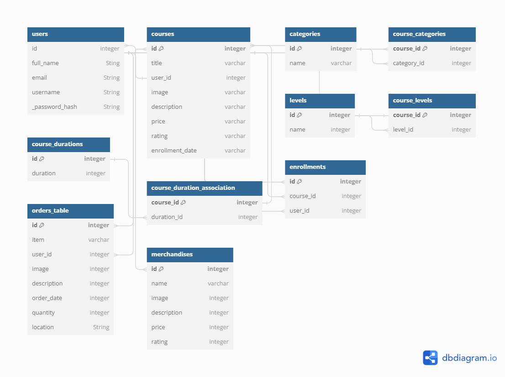

# CryptoChuo-Backend
This document provides an overview of the backend for the web application. This application is built to interact with a backend API that handles the CryptoChuo domain, including models, relationships, and validations.

## Running the Application

To set up and run the project, follow these steps:

1. Clone the repository 

    ```bash
   git clone git@github.com:Ombito/CryptoChuo-Backend.git
    ```

2. Install project dependencies and enter the virtual environment:
   
    ```bash
   pipenv install
   pipenv shell
   pip install -r requirements.txt
    ```
3. Set up the database by running:
   
    ```bash
    flask db init
    flask db revision --autogenerate -m "Create tables"
    flask db upgrade
    ```

4. Start the server
    ```bash
    python3 app.py
    ```
5. Access the API through the specified endpoints.


## Technologies used
- Python Flask
- PostgreSQL database
- SQLAlchemy


## Models

1. User
- Relationships:
    - courses: One-to-Many relationship with Course
    - all_orders: One-to-Many relationship with OrderRecord
    - enrollments: One-to-Many relationship with Enrollment

2. Courses 
- Relationships
    - user: Many-to-One relationship with User
    - enrollments: One-to-Many relationship with Enrollment
    - categories: Many-to-Many relationship with Category
    - durations: Many-to-Many relationship with CourseDurationAssociation
    - levels: Many-to-Many relationship with CourseLevel

3. Category
- Relationships:
    - courses: Many-to-Many relationship with CourseCategory

4. CourseCategory
- Relationships:
    - course: Many-to-One relationship with Course
    - category: Many-to-One relationship with Category

5. CourseDuration
- Relationships:
    - courses: Many-to-Many relationship with CourseDurationAssociation   

6. CourseDurationAssociation
- Relationships:
    - course: Many-to-One relationship with Course
    - duration: Many-to-One relationship with CourseDuration

7. Level
- Relationships:
    - courses: Many-to-Many relationship with CourseLevel

8. CourseLevel
- Relationships:
    - course: Many-to-One relationship with Course
    - level: Many-to-One relationship with Level

9. OrderRecord
- Relationships:
    - user: Many-to-One relationship with User
    - merchandise: Many-to-One relationship with Merchandise

10.  Merchandise
- Relationships:
    - orders: One-to-Many relationship with OrderRecord

11.  Enrollment
- Relationships:
    - course: Many-to-One relationship with Course
    - user: Many-to-One relationship with User
  
Please refer to the db diagram below for a clear graphical representation.



## API Endpoints
Please refer to the [API documentation]() to view all endpoints.


## Notes

- Ensure that the necessary dependencies are installed (Flask, Flask-RESTful, Flask-Migrate, etc.).
- User authentication is handled with sessions, and passwords are hashed using bcrypt.
- The application includes error handling for NotFound exceptions.
- Adjust the configuration settings (database URI, session settings, etc.) based on deployment requirements.


## Contributing

If you would like to contribute to this project, please follow the standard open-source contribution guidelines and submit pull requests. For major changes, please open an issue first to discuss what you would like to change.

## License

This project is licensed under the [MIT License](LICENSE).
